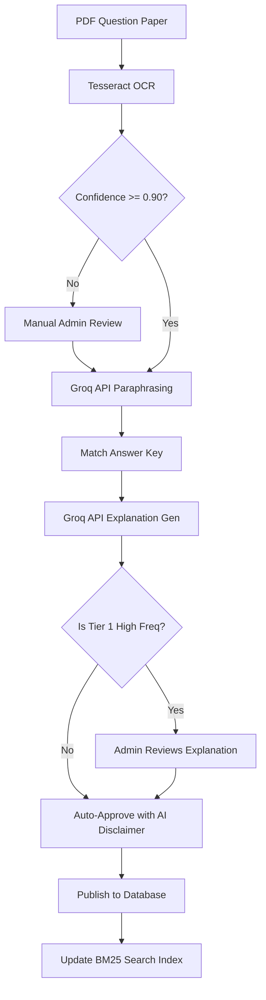
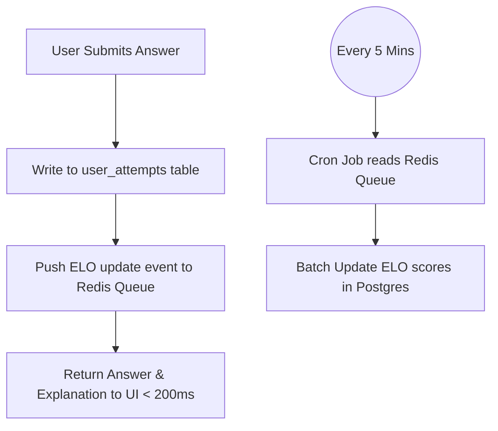
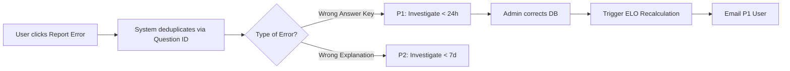

# Business Requirement Document (BRD) — PYQBASE
**Date:** July 2026  
**Status:** DRAFT — Pending answers to Open Questions (Section 6)  

This BRD translates the PYQBASE Product Requirements Document (PRD v3.0) into strict business rules, workflows, and edge-case definitions for technical implementation.

---

## 1. Business Rules
*These are immutable rules that the system must enforce programmatically.*

*   **BR-01 (Quiz Limits):** A free user account is restricted to exactly **30 question attempts per calendar day**. The counter resets exactly at 00:00 IST (Indian Standard Time). A single user answering the same question twice on the same day counts as 2 attempts.
*   **BR-02 (Mock Test Limits):** A free user account is restricted to generating **1 custom mock test per calendar week**. The counter resets at 00:00 IST on Monday.
*   **BR-03 (Refund Policy):** Users are eligible for a 100% refund only if they request it within **7 days** (168 hours) of their initial payment timestamp.
*   **BR-04 (Content Publication):** No question can be published to the live platform unless it has an answer key, a subject tag, and an OCR parse confidence of ≥ 0.90 (or manual admin approval).
*   **BR-05 (Account Deletion):** Deleting an account triggers a "Soft Delete". Data is hidden from public UI immediately, but retained in the DB for **30 days** before a background cron job executes a hard delete.

---

## 2. Permissions & Authorization

| Role | Access Level | Restrictions |
| :--- | :--- | :--- |
| **Anonymous (Unauthenticated)** | Read-only access to Topic Dashboards and Search. | Cannot see full question options or explanations. Cannot save progress. |
| **Free User** | Practice quizzes (30 attempts/day), Custom Mock (1/week), Unlimited SRS, View Heatmaps. | Cannot access Weak Area Generator or Personal Syllabus Coverage. |
| **Premium User** | Unlimited practice, Unlimited Mock Tests, Full Analytics, Personal Coverage. | None within the consumer app. |
| **Admin** | Full CRUD access to content, tags, and users via isolated Admin UI. | Requires `is_admin` custom JWT claim. |

---

## 3. Workflow Diagrams

### 3.1 Content Ingestion Pipeline

### 3.2 Quiz Session & ELO Update Flow

### 3.3 Error Report Triage

---

## 4. Edge Cases, Exceptions & Error Handling

### 4.1 Exception Cases
*   **Subscription Payment Failure:** If Razorpay fails to auto-renew, the system must grant a **7-day grace period**. The user remains on Premium. If payment is not secured by day 7, the account gracefully downgrades to Free. History (tests, SRS) must NOT be deleted upon downgrade.
*   **Dropped Questions:** If UPSC drops a question from official evaluation:
    *   *System Behavior needed:* The DB must support a `correct_option = 'DROPPED'` state. It is not included in total marks, no marks are awarded, no negative marks are deducted, and it must be clearly labeled as "Dropped by UPSC".

### 4.2 Error Cases
*   **Groq API Rate Limits:** If the explanation batch job hits a `429 Too Many Requests` error from Groq, the pipeline must pause using exponential backoff (e.g., wait 60s, then 120s) instead of failing the job.
*   **Supabase Auth Outage:** If Supabase is down, the frontend must display a friendly "Maintenance Mode" banner. The system must not crash throwing raw 500 errors.
*   **Midnight Boundary Quiz:** If a user submits an answer exactly at 23:59:59 IST and the next at 00:00:01 IST, the system must properly register the second attempt against the *next* day's quota without breaking the active quiz session state.

---

## 5. Regulatory & Scalability Concerns

### Regulatory (India Specific)
*   **DPDP Act (2023):** Users must be able to export their data. The platform must provide a secure `/account/export` endpoint that zips `user_attempts`, `user_question_srs`, and `mock_tests` into a downloadable CSV/JSON within 72 hours of request.
*   **Copyright Adaptation:** The system strictly mandates that no question stem is published unless it has passed through the Paraphrasing Pipeline to avoid verbatim copyright infringement of government papers.

### Scalability Mitigations
*   **Write Contention:** The decision to write ELO difficulty changes to Redis first (and batch-flush every 5 minutes) protects the PostgreSQL `questions` table from row-level locking during peak usage.
*   **Memory Exhaustion:** `rank-bm25` requires the inverted index to sit in RAM. Operations must monitor the FastAPI server memory. If the BM25 index crosses 80% of available container RAM, the team must trigger a migration to Postgres FTS.

---

## 6. Resolved Business Decisions

1. **Subscription Management:** We will use Razorpay's pre-built Customer Portal for subscription management to save development time.
2. **"Dropped" Questions (UPSC Error):** If UPSC drops a question, it is NOT included in the total marks, no marks are awarded, no negative marks are deducted, and it is clearly labeled as "Dropped by UPSC" in the UI.
3. **Free Tier Abuse Prevention:** We will implement device-fingerprinting for the MVP to enforce the 30-question free limit and prevent users from simply creating infinite free accounts.
4. **Password Policy & Login:** Minimum password length is 8 characters. We will also provide passwordless login via Google (using Supabase Auth to maintain architecture consistency while delivering the same 1-click UX).

---
*Prepared by Senior Business Analyst*
