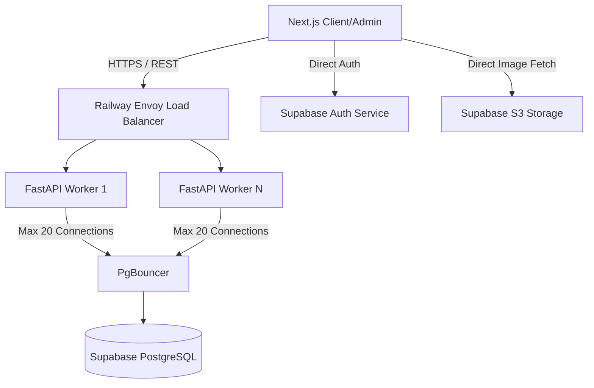
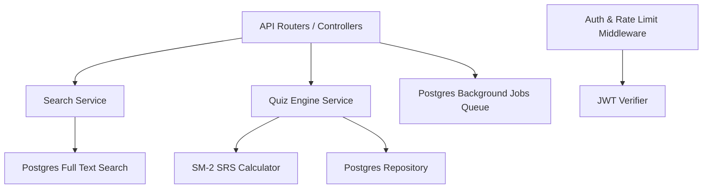
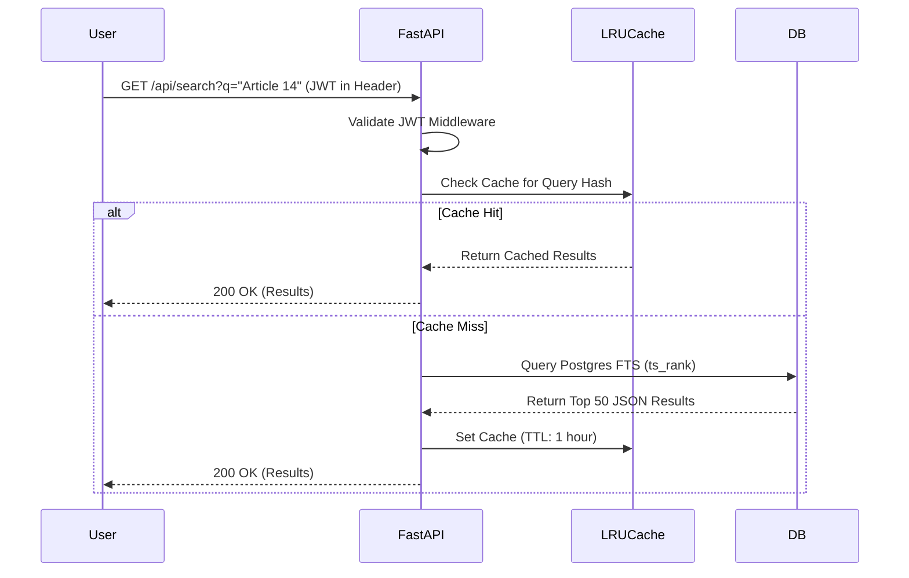
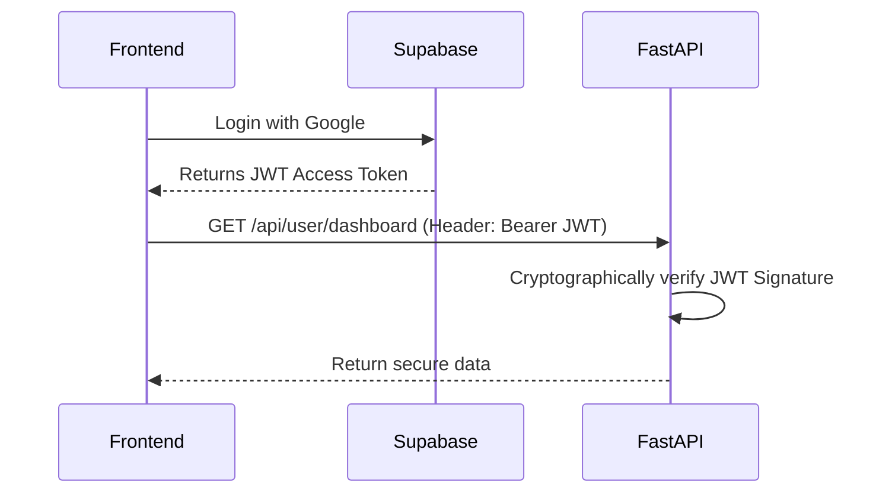

# PYQBASE Backend System Architecture
**Author:** Senior System Architect  
**Date:** July 2026  
**Status:** Finalized for Development  

This document details the backend engineering design for PYQBASE, adhering to the principles of high performance, bootstrapper-friendly cost efficiency, and modular scalability.

---

## 1. Microservice vs Monolith Decision

**Decision:** We will build a **Modular Monolith** using FastAPI.

**WHY:** 
For a solo founder in the MVP-to-Growth phase, a Microservices architecture introduces severe operational overhead (complex CI/CD, cross-service latency, tracing, and high base cloud costs). A Modular Monolith keeps all business logic in a single deployed repository while strictly enforcing internal logical boundaries (separation of concerns). As load increases, Railway easily scales the monolithic container horizontally. If a specific module (e.g., the BM25 Search Engine) becomes a memory bottleneck at 100k+ users, it can be seamlessly carved out into a microservice later because the internal boundaries are already respected.

---

## 2. Service Diagram

This illustrates the macro-level infrastructure nodes.

**WHY:** 
- **FastAPI (Railway):** Extremely fast async Python framework. Perfect for handling ML data flows and concurrent I/O.
- **Supabase (PostgreSQL + Auth):** Managed backend-as-a-service reduces DevOps overhead. Auth handles Google OAuth natively without custom backend state. Postgres handles native Full Text Search (FTS).
- **PgBouncer:** Serverless/Edge functions and auto-scaling containers can quickly exhaust Postgres connections. PgBouncer pools connections to prevent DB outages.

---

## 3. Component Diagram

Internal structure of the FastAPI application.

---

## 4. Request Flow (Search Example)

---

## 5. Data Flow (ELO Difficulty Batching)

**Decision:** Asynchronous batched database writes for high-frequency actions.

**WHY:** If 500 users submit an answer concurrently, doing 500 synchronous `UPDATE` statements on the Postgres `questions` table will cause row-level locking and severe contention.

**Flow:**
1. User submits answer -> FastAPI returns 200 OK immediately.
2. FastAPI inserts `{question_id, new_elo, timestamp}` into Postgres `background_jobs` table.
3. A FastAPI `@repeat_every(seconds=300)` background task polls the table using `FOR UPDATE SKIP LOCKED`.
4. Worker executes a single bulk SQL `UPDATE` statement against the `questions` table and marks jobs as complete.

---

## 6. Authentication Flow

**Decision:** Stateless JWT via Supabase Auth.

**WHY:** Allows the Next.js frontend to interact directly with Supabase for login (Email/Google), reducing backend load. FastAPI only needs to verify the token signature cryptographically without querying the database.

---

## 7. Authorization Flow

**Decision:** JWT Custom Claims for RBAC (Role-Based Access Control) + Device Fingerprinting.

**WHY:** Standard JWT checks are fast. For the free tier limit, we cannot rely on user ID (easily spoofed by fake emails). We authorize free attempts by checking a hashed Device Fingerprint against a daily limit table/cache.

*   **Admin Routes:** `Depends(verify_admin)` checks if `is_admin = true` exists inside the decoded JWT payload.
*   **Premium Routes:** `Depends(verify_premium)` checks the `users` table via an LRU cache to see if `subscription_status = 'active'`.

---

## 8. Load Balancing

**Decision:** Managed Layer 7 Load Balancing via Railway (Envoy Proxy).

**WHY:** As a solo founder, managing NGINX/HAProxy manually is a waste of time. Railway automatically provides HTTPS termination and round-robin load balances requests across multiple FastAPI container instances based on CPU/RAM thresholds.

---

## 9. Queue System

**Decision:** Postgres `background_jobs` table using `FOR UPDATE SKIP LOCKED`.

**WHY:** Celery, RabbitMQ, or even Redis requires dedicated infrastructure, complex configuration, and high memory overhead. PostgreSQL natively supports highly concurrent queuing via `SKIP LOCKED`, allowing us to keep our stack simple (FastAPI + Supabase) while batching ELO updates efficiently.

---

## 10. Rate Limiting

**Decision:** In-Memory Token Bucket (e.g., via `slowapi` with memory backend) or Postgres-backed rate limiting.

**WHY:** To prevent brute-force API attacks and ELO manipulation without introducing Redis.
*   Global API Limit: 100 requests / minute per IP.
*   Quiz Submission Limit: 30 requests / day per Device ID.

---

## 11. API Gateway

**Decision:** FastAPI native routing (No external API Gateway).

**WHY:** AWS API Gateway or Kong adds unnecessary latency, complexity, and cost for a monolith. FastAPI natively handles routing, Swagger UI generation, and CORS. Railway's proxy handles DDoS protection at the network layer.

---

## 12. Security Layers

*   **Layer 1 (Network):** Railway Edge DDoS protection.
*   **Layer 2 (Application - CORS):** FastAPI strict CORS policy (only allowing production Next.js domains).
*   **Layer 3 (Auth):** Cryptographically signed JWT verification.
*   **Layer 4 (Database):** SQL Injection prevented natively by using parameter binding in SQLModel/SQLAlchemy.
*   **Layer 5 (Attack Surface):** Admin Panel deployed to a separate URL/bundle, completely hidden from public users.

---

## 13. Disaster Recovery

*   **RPO (Recovery Point Objective):** 24 hours (maximum data loss acceptable is 1 day of quiz history).
*   **RTO (Recovery Time Objective):** 2 hours (time to spin up a new database and deploy the backend).
*   **Mechanism:** Supabase provides automated daily backups and Point-in-Time Recovery (PITR) for the Pro plan. If Railway goes down entirely, the FastAPI Docker container can be deployed to DigitalOcean or AWS AppRunner in minutes.

---

## 14. Backup Strategy

*   **Database:** Supabase automated daily logical backups (pg_dump) stored in AWS S3 across multiple availability zones.
*   **Media (Supabase Storage):** Inherits AWS S3 99.999999999% durability.
