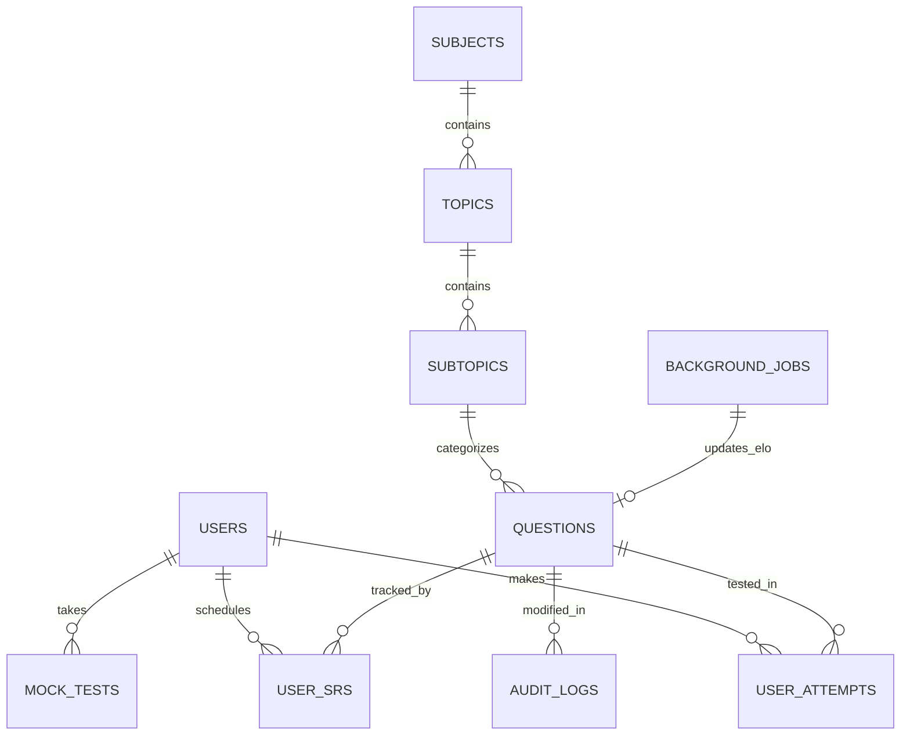

# PYQBASE Database Architecture
**Author:** Senior Database Architect  
**Date:** July 2026  
**Status:** Finalized for Development  

This document outlines the complete relational database design for PYQBASE, hosted on Supabase PostgreSQL. It focuses on high-performance querying, strict data integrity, and future-proof scalability. *(Note: SQL DDL scripts are omitted per requirements).*

---

## 1. Entity-Relationship (ER) Diagram

---

## 2. Core Tables, Columns & Relationships

### Identity Context
*   **`users`**
    *   `id` (UUID, PK) - Maps to Supabase Auth UID.
    *   `email` (String, Unique)
    *   `role` (Enum: 'user', 'admin')
    *   `subscription_status` (Enum: 'free', 'active', 'past_due', 'canceled')
    *   `deleted_at` (Timestamp, Nullable) - For soft deletes.

### Taxonomy Context (Strict Hierarchy)
*   **`subjects`** (e.g., Geography) -> `id` (UUID, PK), `name` (String, Unique)
*   **`topics`** (e.g., Climatology) -> `id` (UUID, PK), `subject_id` (FK), `name` (String)
*   **`subtopics`** (e.g., Monsoon) -> `id` (UUID, PK), `topic_id` (FK), `name` (String)

### Content Context
*   **`questions`**
    *   `id` (UUID, PK)
    *   `exam` (String) & `year` (Integer)
    *   `question_stem` (JSONB) - e.g., `{"en": "Text...", "hi": "Text..."}`
    *   `options` (JSONB)
    *   `correct_option` (String) - Can hold 'A', 'B', 'C', 'D', or 'DROPPED'.
    *   `image_url` (String, Nullable)
    *   `subtopic_id` (FK to subtopics)
    *   `elo_rating` (Integer, Default 1200)
    *   `search_vector` (TSVECTOR) - For Postgres Full Text Search.

### User Progress Context
*   **`user_attempts`**
    *   `id` (UUID, PK)
    *   `user_id` (FK to users)
    *   `question_id` (FK to questions)
    *   `is_correct` (Boolean)
    *   `attempt_date` (DATE) - Stored as IST (Indian Standard Time).
*   **`user_srs`**
    *   `id` (UUID, PK)
    *   `user_id` (FK), `question_id` (FK)
    *   `next_review_date` (DATE) - Stored as IST.
    *   `interval` (Integer) & `ease_factor` (Float) - SM-2 logic.

### Queue Context
*   **`background_jobs`**
    *   `id` (UUID, PK)
    *   `task_type` (String)
    *   `payload` (JSONB) - e.g., `{"question_id": "...", "new_elo": 1250}`
    *   `status` (Enum: 'pending', 'processing', 'completed', 'failed')
    *   `locked_at` (Timestamp, Nullable) - For `SKIP LOCKED` concurrency control.

---

## 3. Constraints & Composite Keys

To ensure absolute data integrity at the database layer (preventing application-layer race conditions):
1.  **Unique Topic Names:** `UNIQUE(subject_id, name)` in `topics`.
2.  **Unique SRS Records:** `UNIQUE(user_id, question_id)` in `user_srs`. A user can only have one active SRS schedule per question.
3.  **Foreign Key Cascades:** Deleting a `topic` will `RESTRICT` if `questions` are attached, preventing accidental orphaning of PYQs.

---

## 4. Indexes for Performance

Indexes are strategically placed to support the heaviest read queries:
1.  **Daily Quota Check:** `CREATE INDEX idx_user_attempts_date ON user_attempts (user_id, attempt_date);` (Fast lookup to count a user's attempts today).
2.  **SRS Queue Generation:** `CREATE INDEX idx_srs_review_date ON user_srs (user_id, next_review_date);`
3.  **Question Filtering:** `CREATE INDEX idx_questions_subtopic ON questions (subtopic_id);`
4.  **Full Text Search (FTS):** `CREATE INDEX idx_questions_search ON questions USING GIN (search_vector);` (Enables lightning-fast text search directly in PostgreSQL, eliminating the need for external search engines).

---

## 5. UUID Strategy

**Decision:** `uuid_generate_v4()` for all Primary Keys.
*   **Why:** Sequential integers (1, 2, 3) allow ID Enumeration Attacks (e.g., scraping `api/questions/1`, `api/questions/2`). UUIDs completely secure endpoints. They also allow for distributed data generation (e.g., the founder can generate mock data locally with UUIDs and safely import them without ID collisions).

---

## 6. Soft Delete Strategy

**Decision:** `deleted_at` timestamp on the `users` table.
*   **Why:** Hard-deleting a user immediately cascades and deletes their `user_attempts`, which breaks historical aggregate analytics (e.g., "What % of people got this right?"). 
*   **Implementation:** All queries fetching users must append `WHERE deleted_at IS NULL`. A background cron job runs daily to permanently `DELETE` records where `deleted_at < NOW() - INTERVAL '30 days'` to comply with the DPDP Act.

---

## 7. Audit Logs, Versioning & History

**Decision:** Dedicated `audit_logs` table for Content changes.
*   **Structure:** `{id, admin_id, table_name, record_id, action, previous_payload (JSONB), new_payload (JSONB), timestamp}`
*   **Why:** When an admin corrects a wrong Answer Key or Explanation, we must track *who* changed it and *when*, preserving the old JSON payload in case a rollback is needed. This satisfies the "Immutable audit trail" (FR-16.4) requirement.

---

## 8. Scaling Strategy & Partitioning

**Decision:** Range Partitioning on `user_attempts`.
*   **Why:** If we hit 10,000 MAU answering 30 questions a day, `user_attempts` grows by 9,000,000 rows per month. This table will become massively bloated, slowing down inserts.
*   **Implementation:** We will implement PostgreSQL Declarative Partitioning by `attempt_date` (e.g., `user_attempts_2026_q3`, `user_attempts_2026_q4`). This keeps index sizes small in memory and allows us to easily archive old data if needed.

---

## 9. Backup Strategy

*   **Mechanism:** Supabase Pro Managed Backups.
*   **Frequency:** Automated daily logical backups (pg_dump).
*   **PITR (Point-in-Time Recovery):** Enabled. Supabase maintains WAL (Write-Ahead Logs) allowing us to restore the database to *any specific second* in the last 7 days. This is critical if a rogue admin script accidentally mass-deletes questions.
